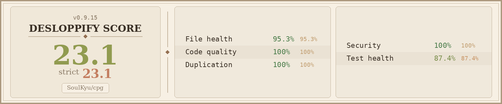

# cpg

**Cilium Policy Generator** -- because writing CiliumNetworkPolicies by hand in a default-deny cluster is nobody's idea of a good Friday night.

## Code quality



Tracked with [desloppify](https://github.com/peteromallet/desloppify) — strict score, regenerated on each code-health pass.

`cpg` connects to Hubble Relay, watches dropped flows in real time, and generates the CiliumNetworkPolicy YAML files that would allow them. You run it, wait for traffic to get denied, and it writes the fix. Then you review, commit, and apply through your GitOps pipeline like a responsible adult.

## The problem

You've deployed Cilium with default-deny. Good for you. Now every new service, every port change, every cross-namespace call gets blocked until someone writes the right policy YAML by hand. You stare at `hubble observe --verdict DROPPED`, translate flow fields into Cilium API objects in your head, and pray you got the label selectors right.

Or you let `cpg` do it.

## How it works

```
         Hubble Relay (gRPC)
              |
         [cpg generate]
              |
     stream dropped flows
              |
     aggregate by workload
              |
     build CiliumNetworkPolicy
              |
     merge with existing files
              |
     write YAML to disk
              |
     you review & git push
```

Flows are aggregated by namespace and workload on a configurable interval (default 5s), so you get one policy per workload -- not one per packet. Existing files are read, merged (new ports and peers appended), and only rewritten if something actually changed.

## Install

```bash
# kubectl krew
kubectl krew install cilium-policy-gen

# go install
go install github.com/SoulKyu/cpg/cmd/cpg@latest
```

Or build from source:

```bash
git clone https://github.com/SoulKyu/cpg.git
cd cpg
make build
# binary lands in ./bin/cpg
```

When installed via krew, use `kubectl cilium-policy-gen` instead of `cpg`. Same flags, same behavior.

Requires Go 1.25+ for source builds.

## Quick start

```bash
# Point at a namespace. cpg auto port-forwards to hubble-relay.
cpg generate -n production

# Explicit relay address
cpg generate --server localhost:4245

# All namespaces, debug logging
cpg --debug generate --all-namespaces

# TLS
cpg generate --server relay.example.com:443 --tls -n production
```

That's it. Leave it running. Go generate some traffic (or wait for someone else to). Ctrl+C when you're done -- cpg flushes remaining flows and prints a session summary before exiting.

Policies show up in `./policies/<namespace>/<workload>.yaml`.

## Quick start (offline replay)

Prefer to iterate on policy generation without reproducing traffic? Capture once, replay many:

```bash
# Capture dropped flows for N minutes
hubble observe --output jsonpb --follow > drops.jsonl
# Ctrl+C when done capturing

# Replay through cpg — reuse the file as many times as you want
cpg replay drops.jsonl -n production
```

`cpg replay` accepts `-` to read from stdin and transparently decompresses `.gz` files.

## Flags

```
cpg generate [flags]

Connection:
  -s, --server string        Hubble Relay address (auto port-forward if omitted)
      --tls                  Enable TLS for gRPC connection
      --timeout duration     Connection timeout (default 10s)

Filtering:
  -n, --namespace strings    Namespace filter (repeatable)
  -A, --all-namespaces       Observe all namespaces

Output:
  -o, --output-dir string    Output directory (default "./policies")

Aggregation:
      --flush-interval dur   Aggregation flush interval (default 5s)

Deduplication:
      --cluster-dedup        Skip policies matching live cluster state (needs RBAC)

Global:
      --debug                Debug logging
      --log-level string     Log level: debug, info, warn, error (default "info")
      --json                 JSON log format
```

## What it generates

Given a dropped ingress flow to a pod labeled `app.kubernetes.io/name: api-server` on port 8080/TCP from a pod with `app: frontend`:

```yaml
apiVersion: cilium.io/v2
kind: CiliumNetworkPolicy
metadata:
  name: cpg-api-server
  namespace: production
spec:
  endpointSelector:
    matchLabels:
      app.kubernetes.io/name: api-server
  ingress:
    - fromEndpoints:
        - matchLabels:
            app: frontend
      toPorts:
        - ports:
            - port: "8080"
              protocol: TCP
```

External traffic (world identity) gets CIDR-based rules (`fromCIDR` / `toCIDR`) with /32 addresses instead of endpoint selectors, because you can't exactly match a label on the internet.

## Offline replay

`cpg replay <file>` feeds a Hubble jsonpb capture through the same pipeline as the live stream. It is the right tool when you want:

- **Deterministic iteration.** Re-run the same input as you tweak label selection, dedup logic, or flush intervals.
- **Offline workflow.** Capture on a jumphost, replay on your laptop.
- **Post-mortem reproduction.** Keep the capture alongside the policy in your GitOps repo so anyone can reproduce what cpg saw.

Capture:

```bash
hubble observe --output jsonpb --follow > drops.jsonl
```

Replay:

```bash
cpg replay drops.jsonl -n production
cpg replay drops.jsonl.gz -n production    # gzip transparent
cat drops.jsonl | cpg replay -              # stdin
```

Flags shared with `generate` (`--output-dir`, `--cluster-dedup`, `--flush-interval`) work identically. Non-DROPPED verdicts and malformed lines are skipped with counters surfaced in the session summary.

## L7 Prerequisites <a id="l7-prerequisites"></a>

> **Note:** This section is a placeholder reserved by Phase 8. The full
> two-step workflow (deploy L4 → enable L7 visibility → re-run with
> `--l7`), starter visibility CNP, and capture-window guidance ship in
> Phase 9 (v1.2 DNS L7 Generation + Docs).
>
> For now: if `cpg generate --l7` (or `cpg replay --l7`) emits the warning
> `--l7 set but no L7 records observed`, the target workloads are not
> producing L7 flow records via Hubble. This requires either an existing
> L7 CiliumNetworkPolicy on those workloads or the (legacy)
> `policy.cilium.io/proxy-visibility` annotation. See the [Cilium L7
> visibility docs](https://docs.cilium.io/en/stable/observability/visibility/)
> until Phase 9 lands.

## Dry-run

Preview what `generate` or `replay` would write without touching any file:

```bash
cpg replay drops.jsonl --dry-run           # with unified diff
cpg replay drops.jsonl --dry-run --no-diff # log-only
cpg generate -n production --dry-run
```

In `--dry-run` mode, all stages of the pipeline run normally: you still see unhandled-flow warnings, cluster-dedup hits, and aggregation logs. Only the filesystem write step is suppressed. When an existing file would change, a unified diff is printed to stdout (colored on a tty, plain otherwise).

## Deduplication

cpg tries hard not to waste your time:

- **File dedup**: if the merged result is identical to what's already on disk, it skips the write.
- **Cross-flush dedup**: if the same policy was written in a previous flush cycle, it's not rewritten.
- **Cluster dedup** (`--cluster-dedup`): fetches live CiliumNetworkPolicies from the cluster and skips policies that already match. Needs `list` RBAC on `ciliumnetworkpolicies.cilium.io`.

## Unhandled flows

Not every dropped flow can become a policy rule. cpg reports what it skips so you can investigate:

- **INFO summary** at each flush cycle -- structured counters by skip reason
- **DEBUG detail** per unique flow -- logged once, with source, destination, port, protocol, and destination labels

Enable debug logging to see individual flows:

```bash
cpg --debug generate -n production
# or
cpg --log-level debug generate -n production
```

### Skip reasons

| Reason | What it means |
|--------|---------------|
| `no_l4` | Flow has no L4 layer (no port/protocol info) |
| `nil_endpoint` | Source or destination endpoint is nil |
| `empty_namespace` | Target endpoint has no namespace (non-reserved identity) |
| `nil_source` | Ingress flow with nil source endpoint |
| `nil_destination` | Egress flow with nil destination endpoint |
| `unknown_protocol` | L4 layer present but protocol not TCP/UDP/ICMP |
| `world_no_ip` | World (external) traffic without an IP address |

### Example output

At INFO level (default):

```
INFO  Unhandled flows summary  {"no_l4": 42, "nil_endpoint": 8, "world_no_ip": 3}
```

At DEBUG level:

```
DEBUG Unhandled flow  {"src": "default/nginx", "dst": "kube-system/coredns", "port": "53", "proto": "UDP", "reason": "no_l4", "dst_labels": ["k8s:app=coredns"]}
```

Reserved identity flows (like `reserved:host` or `reserved:kube-apiserver`) are reported separately as WARN logs with guidance to use CiliumClusterwideNetworkPolicy instead.

## Explain policies

After a run, every emitted rule has per-flow evidence recorded alongside the YAML. Inspect it with `cpg explain`:

```bash
cpg explain production/api-server
cpg explain production/api-server --peer app=frontend
cpg explain production/api-server --ingress --port 8080
cpg explain ./policies/production/api-server.yaml --since 1h --json
```

Example output:

```
Policy: cpg-api-server (production)
Latest session: 2026-04-24 14:02 → 14:15 (source: replay)

Ingress rule
  Peer:        app=frontend (endpoint)
  Port:        8080/TCP
  Flow count:  23
  First seen:  2026-04-24 14:02:11
  Last seen:   2026-04-24 14:15:48

  Sample flows:
    14:02:11  default/frontend → production/api-server  TCP/8080
    14:02:13  default/frontend → production/api-server  TCP/8080
    ...
```

### Where is evidence stored?

Evidence lives outside the output directory to keep GitOps clean:

- **Linux:** `$XDG_CACHE_HOME/cpg/evidence` (defaults to `~/.cache/cpg/evidence`)
- **macOS:** `~/Library/Caches/cpg/evidence`

The path is keyed by a hash of the absolute output directory, so multiple workspaces coexist without collision.

To share evidence with a colleague or archive it:

```bash
cpg replay drops.jsonl -n production --evidence-dir ./evidence
# ... ship ./evidence alongside the policies
cpg explain production/api-server --evidence-dir ./evidence
```

Disable capture with `--no-evidence`. Tune retention per rule with `--evidence-samples` (default 10) and per policy with `--evidence-sessions` (default 10).

## Label selection

Labels are chosen with a priority hierarchy:

1. `app.kubernetes.io/name` if present (Kubernetes standard)
2. `app` if present (common convention)
3. All labels minus a denylist (pod-template-hash, controller-revision-hash, etc.)

This means generated policies survive rolling updates and don't accidentally pin to a specific ReplicaSet.

## Auto port-forward

When you omit `--server`, cpg finds the `hubble-relay` pod in `kube-system` using your kubeconfig and sets up a port-forward automatically. One less terminal tab to manage.

## k9s plugin

You can trigger cpg directly from k9s on a namespace. Drop this into `$XDG_CONFIG_HOME/k9s/plugins.yaml` (usually `~/.config/k9s/plugins.yaml`):

```yaml
plugins:
  cpg:
    shortCut: Shift-G
    description: Generate Cilium policies from dropped flows
    scopes:
    - namespace
    command: cpg
    background: false
    args:
    - generate
    - -n
    - $NAME
    - --cluster-dedup
```

Navigate to a namespace in k9s, press `Shift-G`, and cpg starts streaming dropped flows for that namespace. Ctrl+C to stop -- policies land in `./policies/<namespace>/`.

If you installed via krew instead of `go install`, replace `command: cpg` with `command: kubectl` and prepend `cilium-policy-gen` to the args:

```yaml
plugins:
  cpg:
    shortCut: Shift-G
    description: Generate Cilium policies from dropped flows
    scopes:
    - namespace
    command: kubectl
    background: false
    args:
    - cilium-policy-gen
    - generate
    - -n
    - $NAME
    - --cluster-dedup
```

## Project structure

```
cmd/cpg/           CLI entrypoint (cobra): generate, replay, explain
pkg/labels/        Label selection, denylist, endpoint/peer selector builders
pkg/policy/        Flow-to-CiliumNetworkPolicy builder, merge, semantic dedup, attribution
pkg/output/        Directory-organized YAML writer with merge-on-write
pkg/hubble/        Live gRPC client, aggregator, pipeline orchestration
pkg/k8s/           Kubeconfig loading, port-forward, cluster policy fetching
pkg/flowsource/    Flow stream abstraction: live gRPC or jsonpb file source
pkg/evidence/      Per-rule flow attribution (cpg explain)
pkg/diff/          Unified YAML diff (cpg generate/replay --dry-run)
```

## Development

```bash
make test          # run tests with race detector
make lint          # golangci-lint
make build         # build binary to ./bin/cpg
make all           # lint + test + build
```

The test suite covers label selection, policy building, merging, output writing, flow aggregation, pipeline orchestration, and dedup logic. No live cluster required -- the Hubble gRPC client is mocked via interfaces.

## Limitations

Honest ones:

- **L4 only.** cpg doesn't look at L7 flow data (HTTP paths, DNS names). It generates port-level policies. L7 support is on the roadmap but not here yet.
- **No auto-apply.** cpg writes YAML files. Applying them is your job, presumably through whatever GitOps tooling you already have. This is intentional -- auto-applying network policies in production is how you get paged at 3am.
- **Namespace-scoped only.** It generates CiliumNetworkPolicy, not CiliumClusterwideNetworkPolicy. Cluster-wide policies are typically hand-crafted by platform teams who know what they're doing (allegedly).
- **Named ports aren't resolved.** You get port numbers, not service port names. Port 8080 is port 8080. Less ambiguity, more grep-ability.

## License

Apache 2.0
