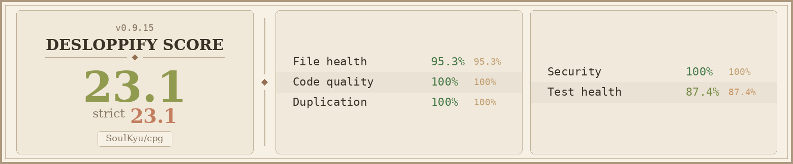

# Development

## Project structure

```
cmd/cpg/           CLI entrypoint (cobra): generate, replay, explain
pkg/labels/        Label selection, denylist, endpoint/peer selector builders
pkg/policy/        Flow-to-CiliumNetworkPolicy builder, merge, semantic dedup, attribution
pkg/output/        Directory-organized YAML writer with merge-on-write
pkg/hubble/        Live gRPC client, aggregator, pipeline orchestration
pkg/k8s/           Kubeconfig loading, port-forward, cluster policy fetching, version detection
pkg/flowsource/    Flow stream abstraction: live gRPC or jsonpb file source
pkg/evidence/      Per-rule flow attribution (cpg explain)
pkg/diff/          Unified YAML diff (cpg generate/replay --dry-run)
```

## Build and test

```bash
make test          # run tests with race detector
make lint          # golangci-lint
make build         # build binary to ./bin/cpg
make all           # lint + test + build
```

The test suite covers label selection, policy building, merging, output writing, flow aggregation, pipeline orchestration, and dedup logic. No live cluster required -- the Hubble gRPC client is mocked via interfaces.

## Code quality



Tracked with [desloppify](https://github.com/peteromallet/desloppify) — strict score, regenerated on each code-health pass.
